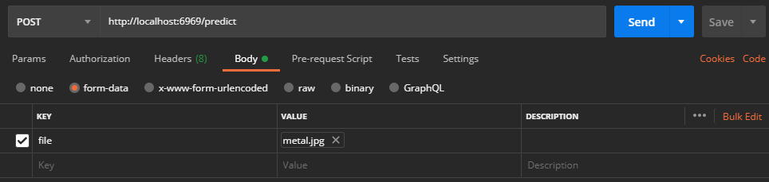
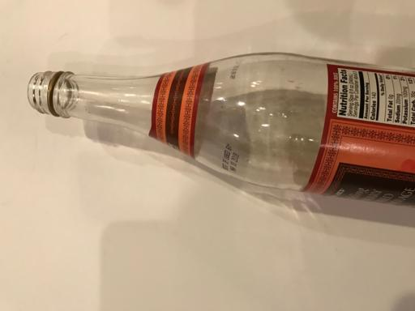

# Garbage Image Classification

## Description

Garbage image classification using PyTorch transfer learning pretrained model Resnet152 with FastAPI for API based application. This model will classification 6 class: cardboard, glass, metal, paper, plastic, trash (other).

## Installation

```bash
$ git clone https://github.com/hafidh561/Garbage-Image-Classification.git
```

### Installation Python

```bash
# Python version 3.6
$ git clone https://github.com/nodefluxio/vortex.git
$ cd vortex/ && git checkout drop-enforce
$ pip install ./src/runtime[onnxruntime] && cd../
$ pip install -r requirements.txt
$ python download_models.py
```

### Installation Docker

```bash
# Newest docker version
$ docker build -t hafidh561/garbage-image-classification:1.0 .
```

## Usage

### Usage Python

```bash
$ python app.py
```

### Usage Docker

```bash
$ docker run --rm -p <YOUR PORT>:6969 hafidh561/garbage-image-classification:1.0
# Example
$ docker run --rm -p 301:6969 hafidh561/garbage-image-classification:1.0
```

### Usage API

1. After you run app use python or docker, open your web browser and go to http://localhost:<YOUR PORT | 6969>/docs for looksing some documentation.
2. Now it's time to testing API, open your application for testing API. I'll use Postman for testing API.
3. Set up postman like this.

    

4. Press button "Select Files" to select image you want to classification.
5. Press "Send" button and waiting for response.
6. Now open response body and look object response member "class" and search for highest value.

#### Example Test API



```json
{
	"filename": "glass.jpg",
	"contentype": "image/jpeg",
	"class": "glass",
	"confidence": "0.99995697"
}
```

## Report Article

-   [Indonesian Language](https://docs.google.com/document/d/1w12SAlME0w9xAGnaB3kgvrVVqNbADNlxk2_pyF-LylM/edit?usp=sharing)

## Give It a Try

[Google Colab](https://drive.google.com/file/d/1JzcSHE1Evae__zj3bujTb_O-lEOaILk1/view?usp=sharing)

## License

[MIT LICENSE](./LICENSE)

© Developed by [hafidh561](https://github.com/hafidh561) - Internship at Nodeflux
