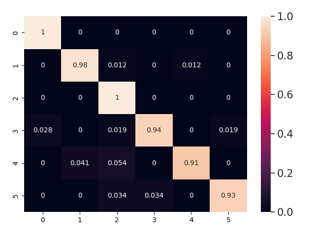
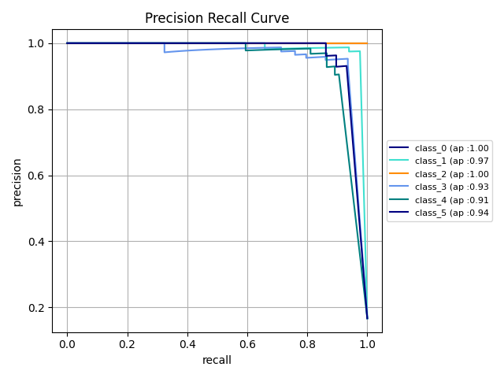
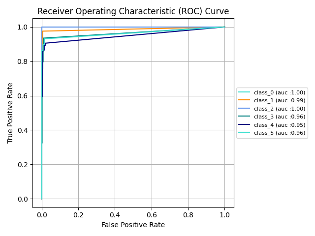
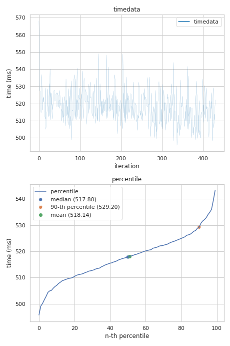
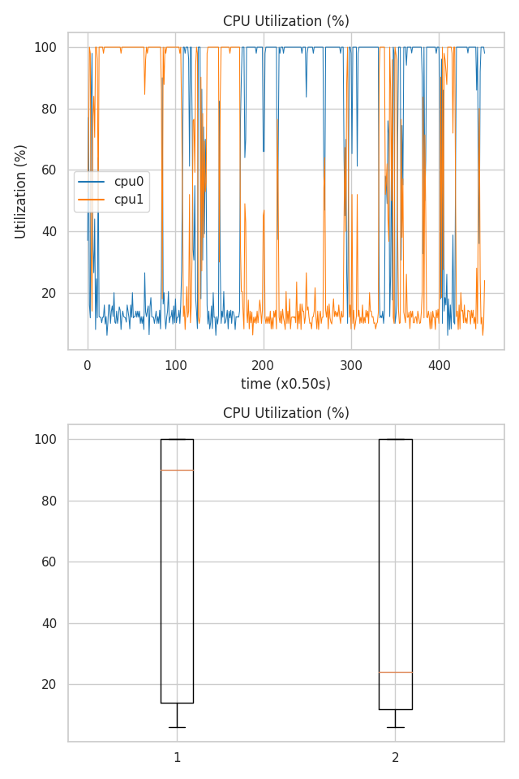
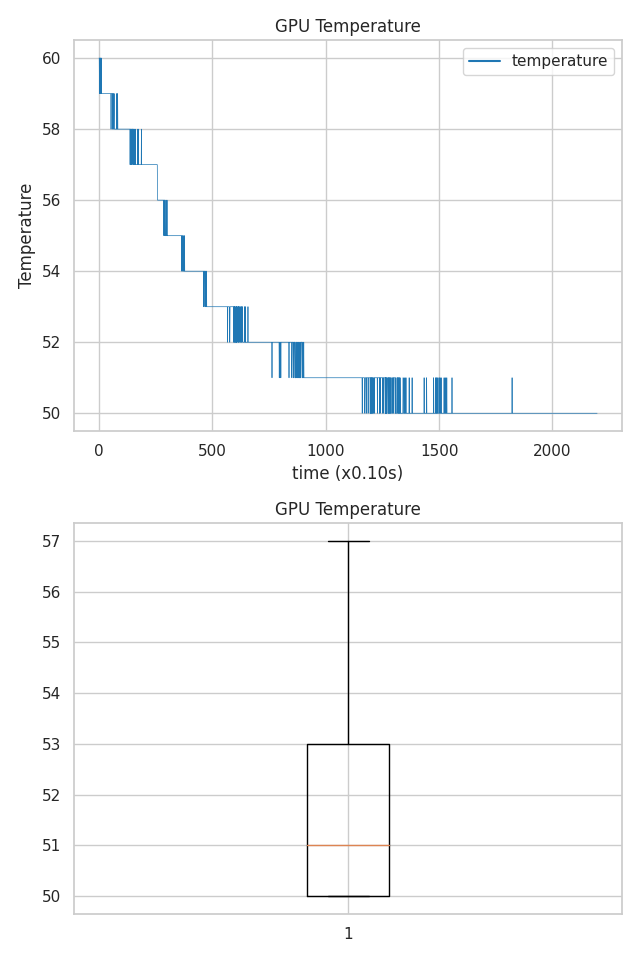
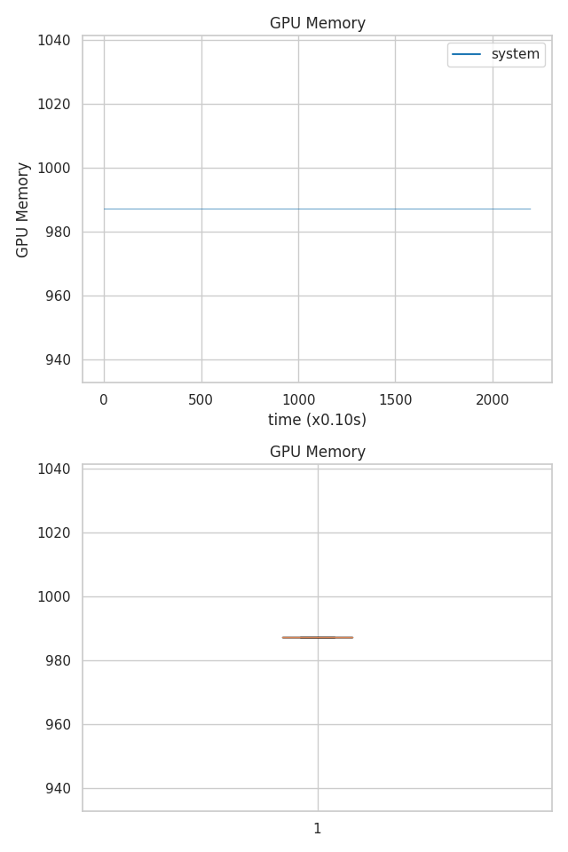

# Metrics
|metric name|value|
|---|---|
|accuracy|0.9582366589327146|
|precision (micro)|0.9582366589327146|
|recall (micro)|0.9582366589327146|
|f1_score (micro)|0.9582366589327146|
|precision (macro)|0.9540035087030173|
|recall (macro)|0.9578724715744621|
|f1_score (macro)|0.9549606016094604|
|precision (weighted)|0.9602192080955329|
|recall (weighted)|0.9582366589327146|
|f1_score (weighted)|0.9582031147796972|

# Assets
- 
- 
- 
# Resources
- 
- 
- 
- 
- 
# Environment
- uname: Linux a456b97d9e50 5.4.104+ #1 SMP Sat Jun 5 09:50:34 PDT 2021 x86_64 x86_64 x86_64 GNU/Linux

- cpu_info: Architecture:        x86_64
CPU op-mode(s):      32-bit, 64-bit
Byte Order:          Little Endian
CPU(s):              2
On-line CPU(s) list: 0,1
Thread(s) per core:  2
Core(s) per socket:  1
Socket(s):           1
NUMA node(s):        1
Vendor ID:           GenuineIntel
CPU family:          6
Model:               63
Model name:          Intel(R) Xeon(R) CPU @ 2.30GHz
Stepping:            0
CPU MHz:             2299.998
BogoMIPS:            4599.99
Hypervisor vendor:   KVM
Virtualization type: full
L1d cache:           32K
L1i cache:           32K
L2 cache:            256K
L3 cache:            46080K
NUMA node0 CPU(s):   0,1
Flags:               fpu vme de pse tsc msr pae mce cx8 apic sep mtrr pge mca cmov pat pse36 clflush mmx fxsr sse sse2 ss ht syscall nx pdpe1gb rdtscp lm constant_tsc rep_good nopl xtopology nonstop_tsc cpuid tsc_known_freq pni pclmulqdq ssse3 fma cx16 pcid sse4_1 sse4_2 x2apic movbe popcnt aes xsave avx f16c rdrand hypervisor lahf_lm abm invpcid_single ssbd ibrs ibpb stibp fsgsbase tsc_adjust bmi1 avx2 smep bmi2 erms invpcid xsaveopt arat md_clear arch_capabilities

- cpu_scaling: ['', '']
- gpu_info: 
# Dataset

Dataset name: Garbage Classification Dataset
|dataset args|value|
|---|---|
|image_size|256|
|batch_size|1|

